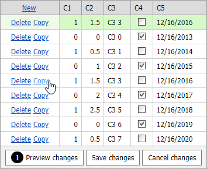

<!-- default badges list -->

[](https://supportcenter.devexpress.com/ticket/details/T114985)
[](https://docs.devexpress.com/GeneralInformation/403183)
<!-- default badges end -->

# GridView for Web Forms - How to implement clone functionality in batch edit mode

This example demonstrates how to implement a custom **Copy** button that allows users to clone a row in [ASPxGridView](https://docs.devexpress.com/AspNet/DevExpress.Web.ASPxGridView) in batch edit mode.



To implement this functionality, follow the steps below.

1. Create a [custom command button](https://docs.devexpress.com/AspNet/DevExpress.Web.GridViewCommandColumn.CustomButtons) and handle the client [CustomButtonClick](https://docs.devexpress.com/AspNet/js-ASPxClientGridView.CustomButtonClick) event.

```aspx
<dx:GridViewCommandColumn ... >
  <CustomButtons>
    <dx:GridViewCommandColumnCustomButton ID="CopyButton" Text="Copy" />
  </CustomButtons>
</dx:GridViewCommandColumn>
<%-- ... --%>
<ClientSideEvents CustomButtonClick="OnCustomButtonClick" ... />
```

2. In the [CustomButtonClick](https://docs.devexpress.com/AspNet/js-ASPxClientGridView.CustomButtonClick) event handler, call the [AddNewRow](https://docs.devexpress.com/AspNet/js-ASPxClientGridView.AddNewRow) method to add a new row.

```js
function OnCustomButtonClick(s, e) {
    if (e.buttonID == "CopyButton") {
        // ...
        s.AddNewRow();
    }
}
```

3. Handle the client [BatchEditStartEditing](https://docs.devexpress.com/AspNet/js-ASPxClientGridView.BatchEditStartEditing) event to insert values of the previous row into the newly created row.

    Use the [rowValues](https://docs.devexpress.com/AspNet/js-ASPxClientGridViewBatchEditStartEditingEventArgs.rowValues) object to define a value for cells in edit mode (every cell in Row edit mode and the focused cell in Cell edit mode) and the client [SetCellValue](https://docs.devexpress.com/AspNet/js-ASPxClientGridViewBatchEditApi.SetCellValue(visibleIndex-columnFieldNameOrId-value)) method to assign values to cells that are not in edit mode (unfocused cells in Cell edit mode).

```aspx
<ClientSideEvents CustomButtonClick="OnCustomButtonClick" BatchEditStartEditing="OnStartEdit" />
```

```js
function OnStartEdit(s, e) {
  // ...
  for (var i = 0; i < s.GetColumnCount() ; i++) {
      var column = s.GetColumn(i);
      if (column.visible == false || column.fieldName == undefined)
          continue;
      ProcessCells(rbl.GetSelectedIndex(), e, column, s);
  }
}
function ProcessCells(selectedIndex, e, column, s) {
    var isCellEditMode = selectedIndex == 0;
    var cellValue = s.batchEditApi.GetCellValue(index, column.fieldName);
    if(isCellEditMode) {
        if(column.fieldName == e.focusedColumn.fieldName)
            e.rowValues[column.index].value = cellValue;
        else
            s.batchEditApi.SetCellValue(e.visibleIndex, column.fieldName, cellValue);
    } else {
        e.rowValues[column.index].value = cellValue;
    }
}
```

## Files to Look At

* [Default.aspx](./CS/WebSite/Default.aspx) (VB: [Default.aspx](./VB/WebSite/Default.aspx))

## Documentation
- [Batch Edit Mode](https://docs.devexpress.com/AspNet/16443/components/grid-view/concepts/edit-data/batch-edit-mode)
- [How to: Create Custom Command Buttons](https://docs.devexpress.com/AspNet/4023/components/grid-view/examples/how-to-create-custom-command-buttons)

## More Examples
- [GridView for MVC - How to implement clone functionality in Batch Edit mode](https://github.com/DevExpress-Examples/gridview-how-to-implement-copy-clone-functionality-in-batch-edit-mode-t115891)
